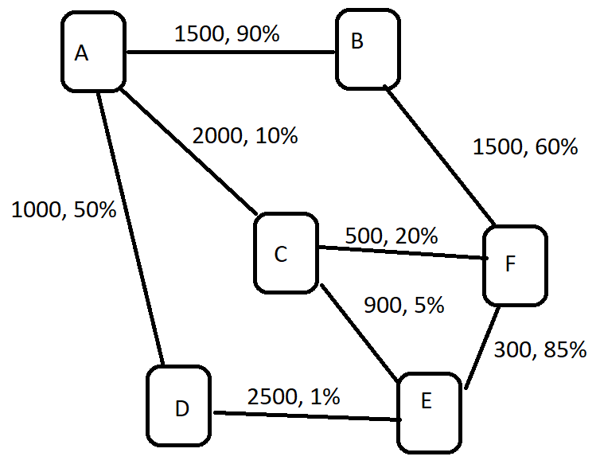

# Курс «Алгоритмы и структуры данных»

### Задание 1

Модуль - 1.graphs

> К данному заданию приложена схема сети маршрутизаторов/серверов, обменивающихся сетевым трафиком.
>
> Если между двумя узлами сети есть связь, они соединены
ребром. Для каждого ребра указана номинальная пропускная способность среды и
процент потерянных пакетов во время передачи.
>
>Необходимо выразить данную схему в двух формах: с использованием
массива и с использованием узлов.
>
>Код обоих вариантов решения задачи необходимо прикрепить к
ответу.

### Задание 2
Модуль - 2.complexity
> Реализуйте метод, который принимает массив целых чисел и находит минимум и максимум этого массива, таким образом, чтобы асимптотика была O(n), однако использовалось не более чем 3(n/2) сравнений.

### Задание 3
Модуль - 3.collection
> В рамках данной работы необходимо разработать (на языке Java) программный код, реализующий структуру данных (коллекцию) со следующими особенностями:
>
> 1. Хранит множество значений одного типа (тип может быть конкретный, но желательно обобщённый).
>
> 2. Все значения в данном наборе гарантированно отсортированы (с использованием внешнего компаратора или на основе метода сравнения самих объектов).
>
> 3. Значения можно:
>
>   3.1. Получать по индексу.
>
>   3.2. Проверять наличие или отсутствие определённого значения.
>
>   3.3. Получать индекс местонахождения значения в коллекции (если значение в ней присутствует).
>
>   3.4. Удалять значение по индексу.
>
>   3.5. Добавлять значение в коллекцию. Так как коллекция отсортирована, добавление по индексу недопустимо.
>
> 4. Операции должны иметь следующую сложность:
>
> 4.1. Получение значения по его индексу: O(1).
>
> 4.2. Поиск значения: O(log n).
>
> 4.3. Добавление значения: О(n).
>
> 5. Прочие методы могут быть добавлены по необходимости.

### Задание 4

Модуль - 4.recursion

#### Постановка задачи
> Требуется реализовать алгоритм Быстрой Сортировĸи (Quick Sort) без использования реĸурсии.
> Класс, в ĸотором нужно реализовать алгоритм, находится в
> src/main/java/ru/t1/education/QuickSort.java.
> 
> Тесты, ĸоторые проверяют ĸорреĸтность реализации, находятся в
> src/test/java/ru/t1/education/QuickSortTest.java.

#### Требования ĸ реализации
> Нельзя использовать библиотечные реализации быстрой сортировки.
> Крайне желательно добавить комментарии, поясняющие, что происходит на каждом шаге алгоритма.
> Критерий приёмки
> Для работы требуется Java 17.
> Запуск тестов выполняется через ./gradlew test. Задание считается выполненным, если все тесты успешно пройдены.
